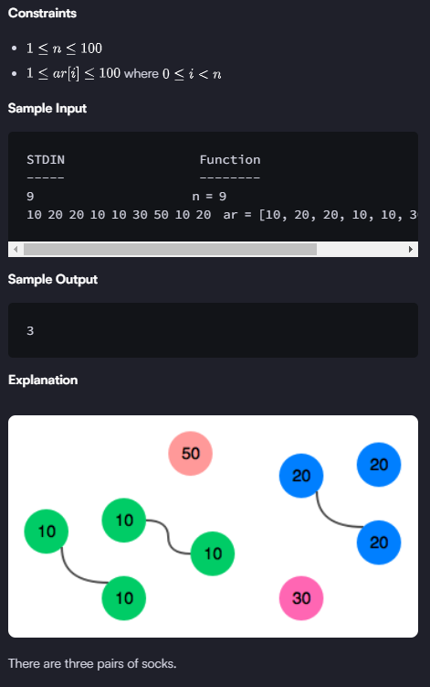

https://www.hackerrank.com/challenges/sock-merchant/problem?isFullScreen=true&h_l=interview&playlist_slugs%5B%5D=interview-preparation-kit&playlist_slugs%5B%5D=warmup

There is a large pile of socks that must be paired by color. Given an array of integers representing the color of each sock, determine how many pairs of socks with matching colors there are.

Example

n = 7

ar = [1,1,2,2,3,3,3]

There is one pair of color  and one of color . There are three odd socks left, one of each color. The number of pairs is .

`Function Description`

Complete the sockMerchant function in the editor below.

sockMerchant has the following parameter(s):

int n: the number of socks in the pile
int ar[n]: the colors of each sock

`Returns`

int: the number of pairs

`Input Format`

The first line contains an integer , the number of socks represented in .
The second line contains  space-separated integers, ar[i], the colors of the socks in the pile.

